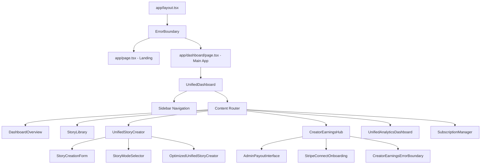
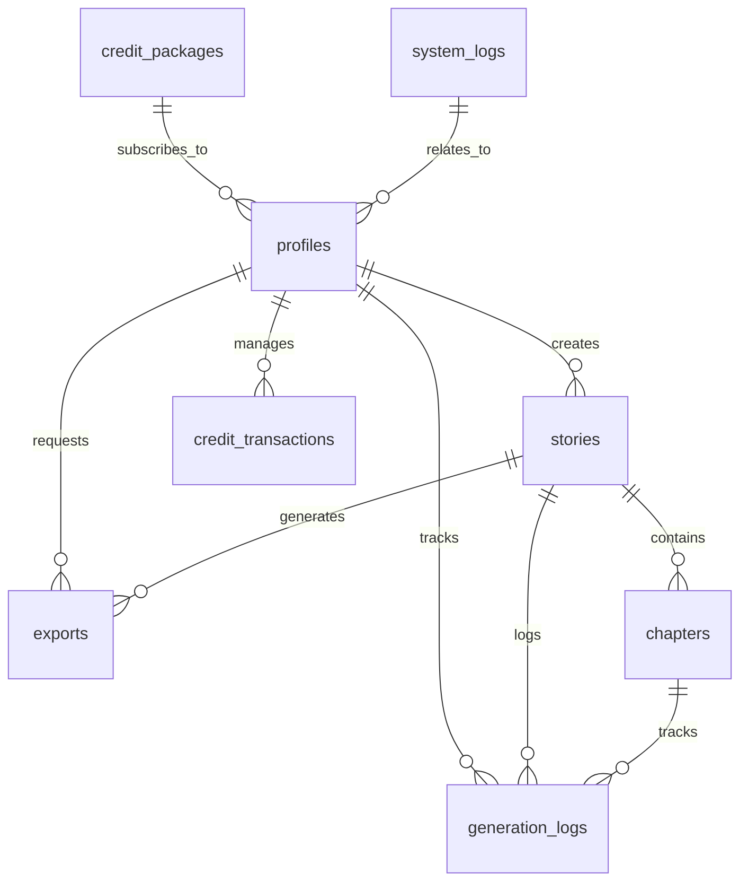

# Infinite Pages - System Architecture Overview

*Generated: September 22, 2025*

## Executive Summary

Infinite Pages is a Next.js 14 application that provides an AI-powered story generation platform. The system integrates Claude AI for content generation, Supabase for backend infrastructure, and Stripe for payment processing. It implements a sophisticated token-based credit system, subscription tiers, and a creator economy with revenue sharing.

---

## 1. Technology Stack & Core Infrastructure

### Frontend Architecture
- **Framework**: Next.js 14 with App Router
- **Language**: TypeScript with strict type checking
- **Styling**: Tailwind CSS with custom glassmorphism design system
- **UI Components**: Shadcn/ui components with custom extensions
- **State Management**: React hooks with server state synchronization

### Backend Services
- **Database**: Supabase (PostgreSQL) with Row Level Security (RLS)
- **Authentication**: Supabase Auth with Google OAuth integration
- **File Storage**: Supabase Storage for exports and media
- **API Layer**: Next.js API routes with middleware authentication

### External Integrations
- **AI Service**: Anthropic Claude API for content generation
- **Payment Processing**: Stripe for subscriptions and payouts
- **Analytics**: Custom analytics with performance tracking
- **Caching**: Redis-like caching with Supabase for performance optimization

---

## 2. Project Structure Analysis

```
infinite-pages/
├── app/                          # Next.js 14 App Router
│   ├── api/                      # API route handlers
│   │   ├── admin/               # Admin management endpoints
│   │   ├── ai/                  # AI service endpoints
│   │   ├── auth/                # Authentication callbacks
│   │   ├── billing/             # Stripe integration
│   │   ├── creators/            # Creator economy features
│   │   ├── credits/             # Credit system management
│   │   ├── stories/             # Story CRUD operations
│   │   └── webhooks/            # External service webhooks
│   ├── dashboard/               # Main application interface
│   ├── layout.tsx               # Root layout with error boundaries
│   └── page.tsx                 # Landing page with authentication
│
├── components/                   # React component library
│   ├── ui/                      # Base UI components (shadcn)
│   ├── dashboard/               # Dashboard-specific components
│   ├── story-creator/           # Story creation workflows
│   └── optimized/               # Performance-optimized components
│
├── lib/                         # Shared utilities and services
│   ├── auth/                    # Authentication middleware
│   ├── claude/                  # AI service integration
│   ├── supabase/                # Database client and types
│   └── constants.ts             # System-wide configuration
│
├── supabase/                    # Database schema and migrations
│   └── migrations/              # Sequential database updates
│
├── types/                       # TypeScript type definitions
├── hooks/                       # Custom React hooks
├── styles/                      # Global styles and design system
└── middleware.ts                # Next.js middleware for security
```

### Architectural Patterns Identified

1. **Layered Architecture**: Clear separation between presentation, business logic, and data layers
2. **Service-Oriented Design**: Modular services for AI, authentication, and payments
3. **Event-Driven Architecture**: Webhook-based integrations for real-time updates
4. **Microservice Communication**: API-first design with RESTful endpoints
5. **Defensive Programming**: Comprehensive error boundaries and fallback mechanisms

---

## 3. Component Hierarchy & Data Flow

### Core Component Architecture



### Component Categorization

#### **Reusable UI Components** (17 components)
Located in `components/ui/`: button, card, dialog, input, select, tabs, etc.
- **Purpose**: Consistent design system implementation
- **Dependencies**: Tailwind CSS, Radix UI primitives
- **Usage**: Imported across all feature components

#### **Feature-Specific Components** (31 components)
Major functional components:
- **Story Creation**: `UnifiedStoryCreator`, `StoryCreationForm`, `TransparentStoryGenerator`
- **Content Management**: `StoryLibrary`, `StoryReader`, `LibraryReader`
- **Creator Economy**: `CreatorEarningsHub`, `StripeConnectOnboarding`, `AdminPayoutInterface`
- **Analytics**: `UnifiedAnalyticsDashboard`, `CacheChart`, `AICostDisplay`
- **Subscription**: `SubscriptionManager`, `CreditPurchase`, `PremiumUpgradePrompt`

#### **Error Handling Components** (4 components)
- `ErrorBoundary`: Root-level error catching
- `CreatorEarningsErrorBoundary`: Feature-specific error handling
- `ErrorFallback`: User-friendly error display
- `LoadingFallback`: Loading state management

#### **Glassmorphism Wrappers** (2 components)
- `GlassStoryCreatorWrapper`: Visual enhancement for story creation
- `GlassCreatorEarningsWrapper`: Visual enhancement for earnings display

### Data Flow Patterns

1. **Unidirectional Data Flow**: Props flow down, events flow up
2. **Server State Synchronization**: API calls trigger component re-renders
3. **Optimistic Updates**: UI updates before server confirmation
4. **Error Propagation**: Errors bubble up through error boundaries
5. **Cache-First Strategy**: Local caching with server synchronization

---

## 4. Database Schema & Data Model

### Core Entity Relationships



### Table Specifications

#### **profiles** - User Management
```sql
Primary Key: id (UUID, references auth.users)
Core Fields:
- email, full_name: User identification
- subscription_tier: 'basic' | 'premium'
- subscription_status: Stripe status tracking
- tokens_remaining: Credit balance (1332 default)
- tokens_used_total: Lifetime usage tracking
- stories_created: Content creation metrics
- is_creator: Creator economy participation
Constraints: RLS enabled, tier validation
```

#### **stories** - Content Management
```sql
Primary Key: id (UUID)
Foreign Keys: user_id -> profiles.id
Core Fields:
- title, genre, premise: Story metadata
- foundation: JSONB AI-generated story bible
- characters: JSONB character definitions
- status: 'draft' | 'in_progress' | 'completed' | 'published'
- total_tokens_used: Cost tracking
Indexes: user_id, created_at DESC
```

#### **chapters** - Content Structure
```sql
Primary Key: id (UUID)
Foreign Keys: story_id -> stories.id
Core Fields:
- chapter_number: Sequential ordering
- content: Chapter text content
- tokens_used_input/output: Generation cost tracking
- generation_cost_usd: Precise cost calculation
Constraints: UNIQUE(story_id, chapter_number)
```

#### **credit_transactions** - Financial Tracking
```sql
Primary Key: id (UUID)
Foreign Keys: user_id -> profiles.id
Core Fields:
- amount: Credit delta (positive/negative)
- transaction_type: 'monthly_distribution' | 'usage_deduction' | etc.
- description: Human-readable explanation
- metadata: JSONB additional context
Indexes: user_id, created_at DESC, transaction_type
```

#### **generation_logs** - AI Usage Analytics
```sql
Primary Key: id (UUID)
Foreign Keys: user_id, story_id, chapter_id
Core Fields:
- operation_type: 'foundation' | 'chapter' | 'improvement'
- tokens_input/output: Token consumption tracking
- cost_usd: Precise cost in USD
Purpose: Analytics, billing reconciliation, usage patterns
```

### Database Functions & Triggers

#### **User Management Functions**
- `handle_new_user()`: Auto-creates profiles for new auth users
- `update_updated_at_column()`: Timestamp maintenance trigger

#### **Credit System Functions**
- `grant_monthly_tokens()`: Automated subscription credit distribution
- `revert_excess_credits()`: Basic tier credit limit enforcement
- `distribute_monthly_credits()`: New standardized credit system

#### **Row Level Security (RLS) Policies**
- Users can only access their own data
- Admin access for system logs and credit transactions
- Cascading permissions for related entities (stories -> chapters)

### Schema Evolution Strategy

The database uses sequential migrations with careful backward compatibility:
1. **001_initial_schema.sql**: Base table structure
2. **002_profile_creation_trigger.sql**: User onboarding automation
3. **003-006**: Caching system implementation
4. **007_business_logic_tables.sql**: Credit system standardization

---

## 5. API Architecture & Endpoints

### API Endpoint Inventory

#### **Authentication & User Management**
```
GET    /api/auth/callback          # OAuth callback handler
GET    /api/dashboard              # User profile and dashboard data
```

#### **Story Management**
```
GET    /api/stories                # List user stories with chapters
POST   /api/stories                # Create new story with AI foundation
GET    /api/stories/[id]/chapters  # Get story chapters
POST   /api/stories/[id]/chapters  # Create new chapter
POST   /api/stories/[id]/chapters/stream # Streaming chapter generation
GET    /api/stories/[id]/choices   # Interactive story choices
POST   /api/stories/[id]/generate-choice-chapter # Choice-based generation
GET    /api/stories/[id]/cover     # Generate story cover art
GET    /api/stories/[id]/export    # Export story in various formats
POST   /api/stories/[id]/read      # Track reading analytics
GET    /api/stories/choice-books   # Choice-based story library
POST   /api/stories/stream         # Streaming story creation
```

#### **AI Integration**
```
POST   /api/ai/optimized           # Optimized AI generation with caching
POST   /api/ai-usage/track         # Track AI usage patterns
```

#### **Credit & Billing System**
```
GET    /api/credits/balance        # Current credit balance
GET    /api/credits/packages       # Available subscription packages
POST   /api/credits/purchase       # Purchase credit packages
POST   /api/billing/create-checkout # Create Stripe checkout session
POST   /api/billing/create-portal  # Access customer portal
POST   /api/billing/webhook        # Stripe webhook handler
```

#### **Creator Economy**
```
GET    /api/creator/earnings       # Creator earnings summary
GET    /api/creator/payout-history # Payout transaction history
GET    /api/creators/earnings/enhanced # Detailed earnings analytics
POST   /api/creators/payout        # Request payout
POST   /api/creators/stripe/onboard # Stripe Connect onboarding
GET    /api/creators/stripe/status  # Onboarding status check
POST   /api/creators/stripe/refresh # Refresh account link
GET    /api/creators/stripe/callback # OAuth callback
```

#### **Admin & Analytics**
```
POST   /api/admin/claude           # Admin Claude AI interface
POST   /api/admin/distribute-credits # Monthly credit distribution
POST   /api/admin/process-payouts  # Process creator payouts
POST   /api/admin/revert-excess-credits # Credit limit enforcement
GET    /api/cache/analytics        # Caching performance metrics
GET    /api/performance            # System performance metrics
GET    /api/errors                 # Error tracking and reporting
GET    /api/health                 # Health check endpoint
```

### API Design Patterns

#### **Authentication Middleware**
All API routes use `requireAuth()` middleware that:
- Validates Supabase JWT tokens
- Checks user permissions
- Provides authenticated Supabase client
- Handles rate limiting based on subscription tier

#### **Rate Limiting Strategy**
```typescript
subscriptionAwareRateLimit(request, operation, userId, tier)
- Basic tier: Lower limits
- Premium tier: Higher limits
- Operation-specific limits (story creation vs. general API)
```

#### **Error Handling Pattern**
```typescript
try {
  // Business logic
} catch (error) {
  console.error('Context-specific error message:', error)
  return NextResponse.json({
    error: 'User-friendly message',
    details: ['Specific error details for debugging']
  }, { status: appropriate_code })
}
```

#### **Response Format Standardization**
```typescript
Success: { data, message?, metadata? }
Error: { error, details?, upgrade_required?, current_tier? }
```

### Content Validation & Security

#### **Input Validation**
- Schema-based validation using centralized constants
- Sanitization of user inputs to prevent XSS
- Content length limits based on subscription tier
- Genre validation against allowed list

#### **Content Moderation**
- Pattern-based content filtering
- Severity scoring system
- AI-specific threat detection (prompt injection, jailbreaking)
- Suspicious content flagging with context awareness

---

## 6. External Service Integrations

### Supabase Backend Infrastructure

#### **Configuration**
```typescript
Environment Variables:
- NEXT_PUBLIC_SUPABASE_URL: Client-side database connection
- NEXT_PUBLIC_SUPABASE_ANON_KEY: Public access key
- SUPABASE_SERVICE_ROLE_KEY: Server-side admin access
```

#### **Usage Patterns**
- **Client-side**: `createClientComponentClient()` for user operations
- **Server-side**: Service role client for admin operations
- **Authentication**: Integrated with Next.js middleware
- **Real-time**: WebSocket subscriptions for live updates
- **Storage**: File uploads for exports and media

### Anthropic Claude AI Integration

#### **Service Architecture**
```typescript
ClaudeService: Main AI interaction service
- generateStoryFoundation()
- generateChapter()
- improveContent()
- Cost calculation and token tracking

ClaudeStreamingService: Real-time content generation
- Streaming chapter creation
- Progress tracking
- Cancellation support

ClaudeCache: Performance optimization
- 80% cost reduction through intelligent caching
- Foundation-level caching by genre and premise
- Character and setting reuse patterns
```

#### **Cost Optimization Strategy**
- **Caching System**: `infinitePagesCache.wrapFoundationGeneration()`
- **Token Management**: Precise tracking of input/output tokens
- **Structured Prompting**: Consistent prompts for better caching
- **Usage Analytics**: Track patterns for optimization opportunities

### Stripe Payment Integration

#### **Subscription Management**
```typescript
Products:
- Basic Subscription: $7.99/month, 1332 credits
- Premium Subscription: $14.99/month, 2497 credits

Webhook Events:
- checkout.session.completed: Subscription activation
- customer.subscription.updated: Plan changes
- customer.subscription.deleted: Cancellation handling
```

#### **Creator Economy (Stripe Connect)**
```typescript
Features:
- Express account onboarding
- Automated payout processing
- Revenue sharing calculations
- Tax document generation
- Compliance monitoring
```

#### **Security Implementation**
- Webhook signature verification
- Customer metadata validation
- Secure API key management
- PCI compliance through Stripe

### Additional Integrations

#### **Google OAuth (via Supabase)**
- Seamless user onboarding
- Profile auto-population
- Secure token exchange

#### **Email Services (via Supabase)**
- Transactional emails
- Subscription notifications
- Creator payout alerts

---

## 7. Security Architecture

### Authentication & Authorization

#### **Multi-Layer Security**
1. **Supabase Auth**: JWT-based authentication with Google OAuth
2. **RLS Policies**: Database-level access control
3. **API Middleware**: Route-level authentication validation
4. **Rate Limiting**: Subscription-aware API protection

#### **User Permissions Model**
```typescript
Roles:
- Anonymous: Landing page access only
- Authenticated: Basic story creation and management
- Premium: Enhanced features and higher limits
- Creator: Revenue sharing and analytics access
- Admin: System management and oversight
```

### Data Protection

#### **Database Security**
- Row Level Security (RLS) on all tables
- Encrypted connections (SSL/TLS)
- Service role key separation
- Audit logging for sensitive operations

#### **Content Security**
- Input sanitization and validation
- Content moderation pipeline
- XSS protection through output encoding
- SQL injection prevention through parameterized queries

#### **API Security**
- CORS configuration
- Request validation middleware
- Error message sanitization
- Rate limiting and DDoS protection

### Privacy & Compliance

#### **Data Handling**
- User data isolation through RLS
- Secure credential storage
- Regular security audits
- Data retention policies

#### **GDPR Considerations**
- User data export capabilities
- Account deletion workflows
- Privacy policy compliance
- Cookie management

---

## 8. Performance Optimization

### Caching Strategy

#### **AI Response Caching**
- **Foundation Caching**: 80% cost reduction for similar story concepts
- **Character Reuse**: Shared character archetypes across stories
- **Template Optimization**: Structured prompts for better cache hits

#### **Database Optimization**
- Strategic indexing on frequently queried columns
- Connection pooling through Supabase
- Query optimization with selective field loading
- Pagination for large result sets

### Frontend Performance

#### **Component Optimization**
- **Code Splitting**: Dynamic imports for heavy components
- **Virtualization**: `VirtualizedStoryList` for large datasets
- **Memoization**: React.memo for expensive computations
- **Error Boundaries**: Isolated failure domains

#### **Asset Optimization**
- **Glassmorphism CSS**: Efficient backdrop filters
- **Font Loading**: Optimized Google Fonts integration
- **Image Optimization**: Next.js automatic optimization

### Monitoring & Analytics

#### **Performance Tracking**
- API response time monitoring
- Database query performance
- Error rate tracking
- User engagement metrics

#### **Cost Management**
- AI usage tracking and optimization
- Credit consumption analytics
- Subscription tier efficiency analysis
- Revenue per user calculations

---

## 9. Development Workflow & Quality Assurance

### Code Organization Principles

#### **TypeScript Implementation**
- Strict type checking enabled
- Centralized type definitions in `/types`
- Database schema type generation
- API response type safety

#### **Error Handling Strategy**
- Hierarchical error boundaries
- Graceful degradation patterns
- User-friendly error messages
- Comprehensive logging

### Testing Architecture

#### **Test Coverage**
- Unit tests with Jest
- Component testing with React Testing Library
- API endpoint testing
- Authentication flow testing

#### **Quality Gates**
- ESLint configuration for code quality
- TypeScript compilation checks
- Build verification
- Security scanning

### Deployment Strategy

#### **Environment Management**
- Development, staging, and production environments
- Environment-specific configuration
- Secret management through Vercel/environment variables
- Database migration automation

---

## 10. Business Logic & Domain Model

### Subscription Tier System

#### **Basic Tier ($7.99/month)**
```typescript
Features:
- 1332 monthly credits
- 5 stories per month
- 2 cover generations
- Basic AI operations only
- Credit reversion at 3996 limit
- Community support
```

#### **Premium Tier ($14.99/month)**
```typescript
Features:
- 2497 monthly credits
- Unlimited stories
- 10 cover generations
- Advanced AI operations
- Download access (5 per month)
- Priority support
- Creator tools access
- No credit reversion
```

### Creator Economy Model

#### **Revenue Sharing**
- Creators earn from user engagement with their content
- Automated payout processing through Stripe Connect
- Tiered earning rates based on performance
- Tax document generation and compliance

#### **Creator Onboarding**
- Stripe Express account setup
- Identity verification
- Bank account linking
- Terms acceptance

### Content Lifecycle

#### **Story Creation Flow**
1. **Foundation Generation**: AI creates story bible with characters, world, plot
2. **Chapter Development**: Incremental content creation with consistency
3. **Quality Enhancement**: AI-powered improvement suggestions
4. **Export Options**: PDF, EPUB, DOCX, TXT formats
5. **Publishing**: Optional creator economy participation

---

## 11. Future Scalability Considerations

### Architecture Scalability

#### **Database Scaling**
- Read replicas for analytics queries
- Partitioning for large tables
- Connection pooling optimization
- Caching layer implementation

#### **API Scaling**
- Horizontal scaling through serverless functions
- CDN integration for static assets
- Background job processing
- Message queue implementation

### Feature Extensibility

#### **AI Service Evolution**
- Multi-model AI integration
- Specialized AI services for different content types
- A/B testing framework for AI prompts
- Custom model fine-tuning

#### **Business Model Expansion**
- Marketplace for creator content
- White-label solutions
- API access for third-party integrations
- Enterprise team features

---

## 12. Risk Analysis & Mitigation

### Technical Risks

#### **AI Service Dependency**
- **Risk**: Claude API unavailability
- **Mitigation**: Graceful degradation, alternative providers, caching

#### **Database Performance**
- **Risk**: Query performance degradation
- **Mitigation**: Monitoring, indexing strategy, query optimization

### Business Risks

#### **Cost Management**
- **Risk**: AI costs exceeding revenue
- **Mitigation**: Dynamic pricing, usage caps, cost monitoring

#### **Content Quality**
- **Risk**: Inappropriate AI-generated content
- **Mitigation**: Content moderation, user reporting, manual review

### Security Risks

#### **Data Breaches**
- **Risk**: User data exposure
- **Mitigation**: Encryption, access controls, audit logging

#### **API Abuse**
- **Risk**: Excessive usage, spam
- **Mitigation**: Rate limiting, content validation, user verification

---

## Conclusion

Infinite Pages represents a sophisticated AI-powered content creation platform with robust architecture supporting scalable growth. The system successfully integrates modern web technologies, AI services, and business logic to create a comprehensive story generation ecosystem.

### Key Architectural Strengths

1. **Modular Design**: Clear separation of concerns enabling independent scaling
2. **Performance Optimization**: Intelligent caching reducing costs by 80%
3. **Security-First Approach**: Multi-layer protection with comprehensive validation
4. **Business Model Integration**: Seamless subscription and creator economy features
5. **Developer Experience**: Type-safe, well-documented, and maintainable codebase

### Strategic Recommendations

1. **Continue AI optimization**: Expand caching strategies and prompt engineering
2. **Enhance monitoring**: Implement comprehensive observability
3. **Scale database architecture**: Prepare for increased user load
4. **Expand creator features**: Build marketplace and collaboration tools
5. **International expansion**: Multi-language and currency support

This architecture provides a solid foundation for the platform's continued growth and evolution in the competitive AI content generation market.